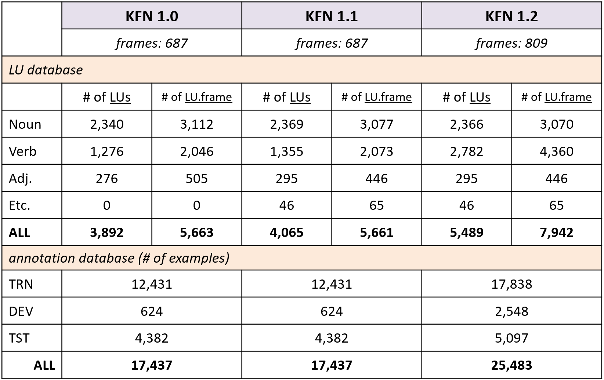

# Korean FrameNet

## About
Korean FrameNet is a lexical database that has rich annotations to represent the meaning of text using semantic frames.

**KFN Statistics**



* frame (frame semantics): a schematic representation of a situation. Korean FrameNet is based on ICSI [FrameNet 1.7](https://framenet.icsi.berkeley.edu/).  **_Verification_** is an example of frames. (*definition: An Inspector attains a degree of certainty in the Unconfirmed_content, generally by inspecting some evidence.*)
* lexical unit (lu): a word with its part-of-speech. e.g. 입증하다.v
* LU.frame: a paring of a lu and frame. e.g. 입증하다.v.Verification

## prerequisite
* `python 3`
* `nltk` (optional)

## How to use
**Install**

`git clone https://github.com/machinereading/koreanframenet.git`

**Import Korean FrameNet (in your python code)**
```
from koreanframenet import koreanframenet
version = 1.2 
kfn = koreanframenet.interface(version=version)
```


### Get LUs by word
```
lus = kfn.lus_by_word('입증하다')
print(lus)
```
```
[
  {'lu': '입증하다.v', 'frame': 'Statement', 'lu_id': 5565}, 
  {'lu': '입증하다.v', 'frame': 'Verification', 'lu_id': 5566}, 
  {'lu': '입증하다.v', 'frame': 'Evidence', 'lu_id': 5564}
]
```


### Get LUs by Frame
```
lus = kfn.lus_by_frame('Verification')
print(lus)
```
```
[
  {'frame': 'Verification', 'lu': '인정받다.v', 'lu_id': 5441},
  {'frame': 'Verification', 'lu': '인정시키다.v', 'lu_id': 5442},
  {'frame': 'Verification', 'lu': '검증되다.v', 'lu_id': 419},
  {'frame': 'Verification', 'lu': '검증시키다.v', 'lu_id': 420},
  {'frame': 'Verification', 'lu': '확인.n', 'lu_id': 7782},
  {'frame': 'Verification', 'lu': '검증하다.v', 'lu_id': 423},
  {'frame': 'Verification', 'lu': '확인되다.v', 'lu_id': 7784},
  {'frame': 'Verification', 'lu': '인증되다.v', 'lu_id': 5449},
  {'frame': 'Verification', 'lu': '인증하다.v', 'lu_id': 5451},
  {'frame': 'Verification', 'lu': '확인하다.v', 'lu_id': 7792},
  ...
```


### Get all frames in KFN
```
frames = kfn.frames()
print(len(frames))
print(frames)
```
```
809
['Abandonment', 'Abounding_with', 'Absorb_heat', 'Abundance', 'Abusing', 'Accompaniment', 'Accomplishment', ...]
```


### Get annotations by LU id
```
annotations = kfn.annotations_by_lu(5566)
print(annotations[4])
```
```
{'arguments': ['한국 축구팬들에게 첫선을 보인 마이클 오언이 [Inspector]',
               '세계 최고 골잡이의 명성을 [Unconfirmed_Content]',
               '그대로 [Manner]'],
 'lu': '입증하다.v.Verification',
 'text': '한국 축구팬들에게 첫선을 보인 마이클 오언이 세계 최고 골잡이의 명성을 그대로 입증했다.'}
```


### Get translated words
You can get the translated words in KFN in terms of frames. For example, the word '입증하다' would be translated to other words in sense of frames such as 'Statement', 'Verification', and 'Evidence'.
```
trans = kfn.get_trans_by_word('입증하다')
print(trans)
```
```
[
  {'frame': 'Statement', 'lu': '입증하다.v', 'trans': ['confirm']},
  {'frame': 'Verification', 'lu': '입증하다.v', 'trans': ['establish', 'prove', 'testify', 'verify']},
  {'frame': 'Evidence', 'lu': '입증하다.v', 'trans': ['demonstrate']}
]
 ```
You can also get translated words directly by LU id. 
```
trans = kfn.get_trans(5566)
print(trans)
```
```
['establish', 'prove', 'testify', 'verify']
```


### (optional) Get frame definition
For advanced search, you can use NLTK FrameNet library (http://www.nltk.org/howto/framenet.html). This is a simple interface for NLTK.
```
definition = kfn.get_frame_definition('Verification')
print(definition)
```
```
A Money_owner exchanges Sum_1 in the  Source_currency for Sum_2 in the Target_currency at some Exchange_service.  'After checking into the Intourist-operated $30-a-day Hotel Zerafshon, we each exchanged $50 for Uzbek currency with a shifty loiterer in the lobby at the rate .'  'We recently exchanged $100 for £64.00 UK pounds.'  'If he exchanged the money into Deutsch-marks, his 18 marks in Germany can just barely obtain four Big Macs.'  'He said the most crucial evidence was that of former police reservist, Simo Petersen-Jessen, now in Australia, who had converted the money into rands.'
```


### (optional) Get frame by English word
For advanced search, you can use NLTK FrameNet library (http://www.nltk.org/howto/framenet.html). This is a simple interface for NLTK.
```
frames = kfn.get_frames_by_trans('verify')
print(frames)
```
```
['Evidence', 'Verification']
```


## How to Load Korean FrameNet dataset: training data, dev data, and test data

`training_data, dev_data, test_data = kfn.load_data()`

Each data is a list for a sentence and its FrameNet annotations. Each sentence consists of four lists: tokens, target, frame, and its arguments. For example, a sentence '한국 축구팬들에게 첫선을 보인 마이클 오언이 세계 최고 골잡이의 명성을 그대로 입증했다.' is shown in following four lists (`dev_data[2330]`):
* TOKENS (`dev_data[2330][0]`): ` ['한국', '축구팬들에게', '첫선을', '보인', '마이클', '오언이', '세계', '최고', '골잡이의', '명성을', '그대로', '입증했다.'] `
* TARGET (`dev_data[2330][1]`): ` ['_', '_', '_', '_', '_', '_', '_', '_', '_', '_', '_', '입증하다.v'] `
* FRAME (`dev_data[2330][2]`): ` ['_', '_', '_', '_', '_', '_', '_', '_', '_', '_', '_', 'Verification'] `
* ARGUMENTS (`dev_data[2330][3]`): ` ['B-Inspector', 'I-Inspector', 'I-Inspector', 'I-Inspector', 'I-Inspector', 'I-Inspector', 'B-Unconfirmed_Content', 'I-Unconfirmed_Content', 'I-Unconfirmed_Content', 'I-Unconfirmed_Content', 'B-Manner', 'O'] `

TARGET list provides target annotation. The tag `_` means that the token is not target word and other tag is target word. For above example, the lexeme "입증하다.v" is annotated for the target word "입증했다" (12th token in TOKEN list. i.e. `dev_data[2330][0][11]`). In this case, the lexeme "입증하다.v" is annotated with the frame **_Verification_**. In terms of FrameNet, arguments is annotated with frame element tags of the frame **_Verification_** with BIO scheme. For above example, the argument "한국 축구팬들에게 첫선을 보인 마이클 오언이" is annotated with **_Inspector_**, the argument '세계 최고 골잡이의 명성을' is with **_Unconfirmed_Content_**, and the argument '그대로' is with **_Manner_**. 


## Licenses
* `CC BY-NC-SA` [Attribution-NonCommercial-ShareAlike](https://creativecommons.org/licenses/by-nc-sa/2.0/)
* If you want to commercialize this resource, [please contact to us](http://mrlab.kaist.ac.kr/contact)

## Publisher
[Machine Reading Lab](http://mrlab.kaist.ac.kr/) @ KAIST

## Contact
Younggyun Hahm. `hahmyg@kaist.ac.kr`, `hahmyg@gmail.com`

## Acknowledgement
This work was supported by Institute for Information & communications Technology Promotion(IITP) grant funded by the Korea government(MSIT) (2013-0-00109, WiseKB: Big data based self-evolving knowledge base and reasoning platform)
