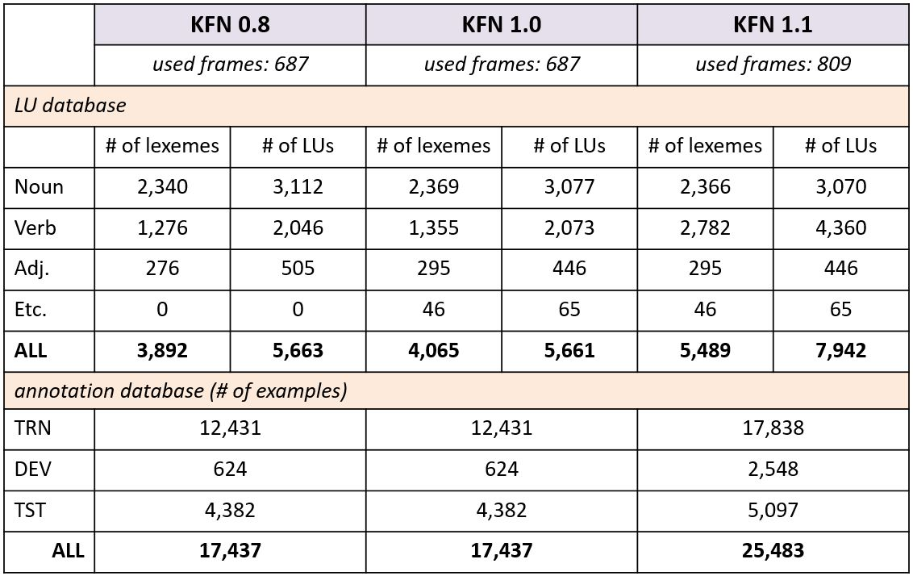

# Korean FrameNet

## About
Korean FrameNet is a lexical database that has rich annotations to represent the meaning of text using semantic frames.

**KFN Statistics***
{:width="100" height="100"}

## prerequisite
* `python 3`
* `nltk` (optional)

## How to use
**Install**

`git clone https://github.com/machinereading/koreanframenet.git`

**Import Korean FrameNet (in your python code)**
```
from koreanframenet import koreanframenet
version = 1.1 
kfn = koreanframenet.interface(version=version)
```

**Get LUs by word**
```
lus = kfn.lus_by_word('입증하다')
`print(lus)
```
```
[
  {'lu': '입증하다.v', 'frame': 'Statement', 'lu_id': 5565}, 
  {'lu': '입증하다.v', 'frame': 'Verification', 'lu_id': 5566}, 
  {'lu': '입증하다.v', 'frame': 'Evidence', 'lu_id': 5564}
]
```

**Get annotations by LU id**
```
annotations = kfn.annotations_by_lu(5566)
print(annotations[4])
```
```
{'arguments': ['한국 축구팬들에게 첫선을 보인 마이클 오언이 [Inspector]',
               '세계 최고 골잡이의 명성을 [Unconfirmed_Content]',
               '그대로 [Manner]'],
 'lu': '입증하다.v.Verification',
 'text': '한국 축구팬들에게 첫선을 보인 마이클 오언이 세계 최고 골잡이의 명성을 그대로 입증했다.'}
```

**Load dataset**

`training_data, dev_data, test_data = kfn.load_data()`

Each data is a list for a sentence and its FrameNet annotations. Each sentence consists of four lists: tokens, target, frame, and its arguments. For example, a sentence '한국 축구팬들에게 첫선을 보인 마이클 오언이 세계 최고 골잡이의 명성을 그대로 입증했다.' is shown in following four lists (`dev_data[2330]`):
* TOKENS: ['한국', '축구팬들에게', '첫선을', '보인', '마이클', '오언이', '세계', '최고', '골잡이의', '명성을', '그대로', '입증했다.']
* TARGET: ['\_', '\_', '\_', '\_', '\_', '\_', '\_', '\_', '\_', '\_', '\_', '입증하다.v']
* FRAME: ['\_', '\_', '\_', '\_', '\_', '\_', '\_', '\_', '\_', '\_', '\_', 'Verification']
* ARGUMENTS: ['B-Inspector', 'I-Inspector', 'I-Inspector', 'I-Inspector', 'I-Inspector', 'I-Inspector', 'B-Unconfirmed_Content', 'I-Unconfirmed_Content', 'I-Unconfirmed_Content', 'I-Unconfirmed_Content', 'B-Manner', 'O']

TARGET list provides target annotation. The tag `_` means that the token is not target word and other tag is target word. For above example, the lexeme "입증하다.v" is annotated for the target word "입증했다" (12th token in TOKEN list. i.e. `dev_data[2330][0][11]`). In this case, the lexeme "입증하다.v" is annotated with the frame Verification. In terms of FrameNet, arguments is annotated with frame element tags of the frame Verification with BIO scheme. For above example, the argument "한국 축구팬들에게 첫선을 보인 마이클 오언이" is annotated with `Inspector`, the argument '세계 최고 골잡이의 명성을' is with `Unconfirmed_Content`, and the argument '그대로' is with `Manner`. 


## Licenses
* `CC BY-NC-SA` [Attribution-NonCommercial-ShareAlike](https://creativecommons.org/licenses/by-nc-sa/2.0/)
* If you want to commercialize this resource, [please contact to us](http://mrlab.kaist.ac.kr/contact)

## Publisher
[Machine Reading Lab](http://mrlab.kaist.ac.kr/) @ KAIST

## Acknowledgement
This work was supported by Institute for Information & communications Technology Promotion(IITP) grant funded by the Korea government(MSIT) (2013-0-00109, WiseKB: Big data based self-evolving knowledge base and reasoning platform)
